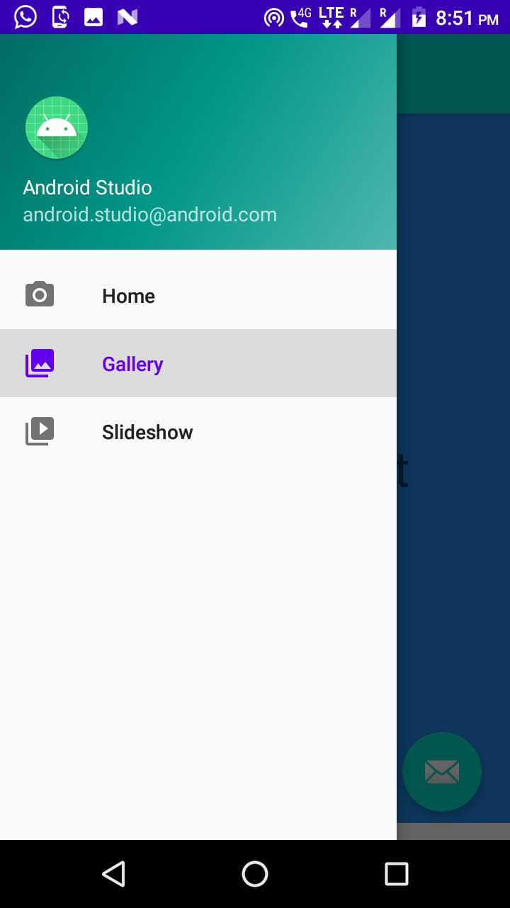
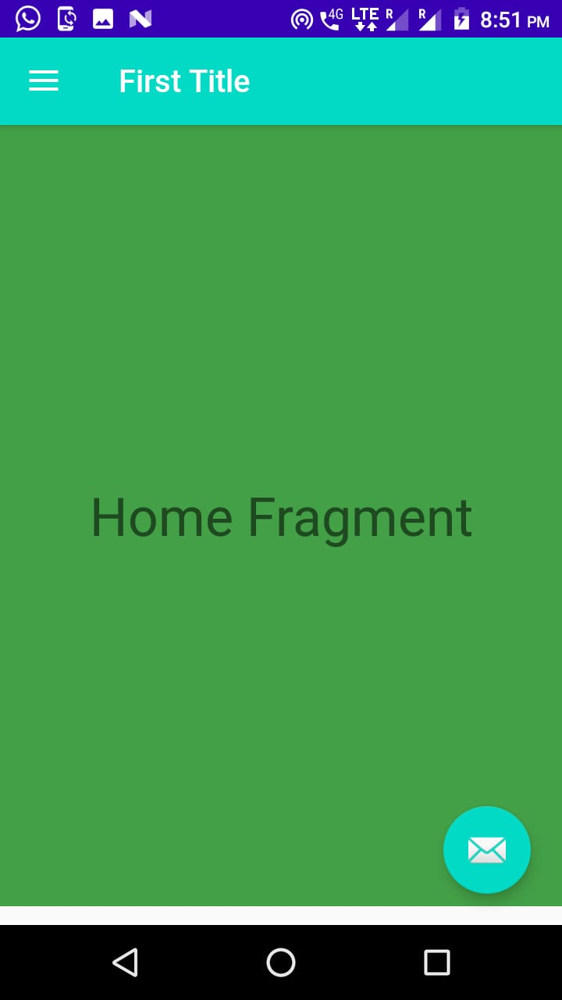

  ## Completed!!!
  Images--
  
  <kbd></kbd>   <kbd></kbd> <kbd></kbd>  <kbd></kbd>
  
  
  * Adding Navigation Header using java:
  
  This app:headerLayout inflates the specified layout into the header automatically. This can alternatively be done at runtime with:
  ```
  // Lookup navigation view
        NavigationView navigationView = (NavigationView) findViewById(R.id.nvView);
  // Inflate the header view at runtime
        View headerLayout = navigationView.inflateHeaderView(R.layout.nav_header);
  // We can now look up items within the header if needed
        ImageView ivHeaderPhoto = headerLayout.findViewById(R.id.imageView);
```


## Method 1:

```
  DrawerLayout drawer = findViewById(R.id.drawer_layout);
        NavigationView navigationView = findViewById(R.id.nav_view);


        // Passing each menu ID as a set of Ids because each
        // menu should be considered as top level destinations.
        mAppBarConfiguration = new AppBarConfiguration.Builder(R.id.nav_home,R.id.nav_gallery,
                R.id.nav_slideshow).setDrawerLayout(drawer).build();

        NavController navController = Navigation.findNavController(this, R.id.nav_host_fragment);
        NavigationUI.setupActionBarWithNavController(this, navController,mAppBarConfiguration);
        NavigationUI.setupWithNavController(navigationView, navController);
        
        
             @Override
     public boolean onCreateOptionsMenu(Menu menu) {
        getMenuInflater().inflate(R.menu.navigational, menu);
        return true;
        // return super.onCreateOptionsMenu(menu);
     }

     @Override
     public boolean onSupportNavigateUp() {
         NavController navController = Navigation.findNavController(this, R.id.nav_host_fragment);
         return NavigationUI.navigateUp(navController, mAppBarConfiguration)
                 || super.onSupportNavigateUp();

     }
```

## Method 2:

Add Frame Layout instead of Fragment in content main:
```
<FrameLayout
        android:layout_width="match_parent"
        android:layout_height="500dp"
        android:id="@+id/Frame_layout"
        app:layout_constraintTop_toTopOf="parent"
        app:layout_constraintLeft_toLeftOf="parent"
        app:layout_constraintRight_toRightOf="parent"
        />
```
Then certain changes in Java
```
 drawer = findViewById(R.id.drawer_layout);
         navigationView = findViewById(R.id.nav_view);

         navigationView.setNavigationItemSelectedListener(this);

        ActionBarDrawerToggle toggle = new ActionBarDrawerToggle(this, drawer, toolbar,
                R.string.navigation_drawer_open, R.string.navigation_drawer_close);
        drawer.addDrawerListener(toggle);
        toggle.syncState();

        //This is when device is rotated, it doesn't looses its fragment.
        if(savedInstanceState == null) {
            //When we start the activity, we do not want to show an empty fragment, so--
            getSupportFragmentManager().beginTransaction().replace(R.id.Frame_layout,
                    new HomeFragment()).commit();
            navigationView.setCheckedItem(R.id.nav_home);
        }
 ```
 After that a back button to close the drawer when required.
 ```
   @Override
     public void onBackPressed() {
         if (drawer.isDrawerOpen(GravityCompat.START)) {
             drawer.closeDrawer(GravityCompat.START);
         } else {
             super.onBackPressed();
         }
     }
```
After that a handler for the items selected.
Dont forget to **implement NavigationView.OnNavigationItemSelectedListener** (Carefull -- Different for Bottom Navigation and Drawer).
```
  @Override
     public boolean onNavigationItemSelected(@NonNull MenuItem item) {
        switch (item.getItemId()){
            case R.id.nav_home:
                getSupportFragmentManager().beginTransaction().replace(R.id.Frame_layout,
                        new HomeFragment()).commit();
                break;
            case R.id.nav_gallery:
                getSupportFragmentManager().beginTransaction().replace(R.id.Frame_layout,
                        new cartFragment()).commit();
                break;
            case R.id.nav_slideshow:
                getSupportFragmentManager().beginTransaction().replace(R.id.Frame_layout,
                        new settingFragment()).commit();
                break;
            //case R.id.something: -- For showing a Toast message
            // Toast();

        }
        drawer.closeDrawer(GravityCompat.START);
        return true;
         //here return false means no item is being selected. So we return true;
     }
```
        
